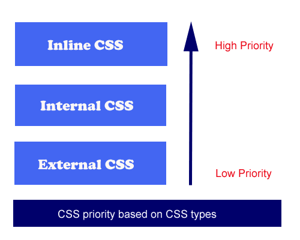

# CSS (_Hojas de Estilo en Cascada_)
Es el lenguaje de estilos utilizado para describir la presentación de los documentos _HTML_.

Nos permite mejorar visualmente nuestra página web.

## Formas de aplicar CSS
Podemos aplicar estilos utilizando el **Inline CSS**, aunque esta práctica no es la más recomendable. El principal motivo es que, si queremos reutilizar este estilo concretamente, debemos copiar todo el código y pegarlo, ocupando un espacio considerable.

Como solución a esto, creando `` dentro del `<body></body>` y utilizando **selectores** podemos definir estilos para elementos que se repetirán a lo largo del documento _HTML_. Esto se conoce como **Internal CSS**.

Por último, podemos definir estos estilos en un archivo externo empleando `<link rel="stylesheet" href="/direccióndenuestrahojadeestilos">`, lo que se conoce como **External CSS**.

Hemos definido las distintas formas de aplicar **CSS** a un documento _HTML_ en un orden que no es aleatorio. El lugar donde definimos el estilo importa, teniendo algunos sitios más prioridad que otros (es decir, el **Inline CSS** es el más específico, sobreescribiendo al **Internal CSS** y este es más específico que el **External CSS**).

